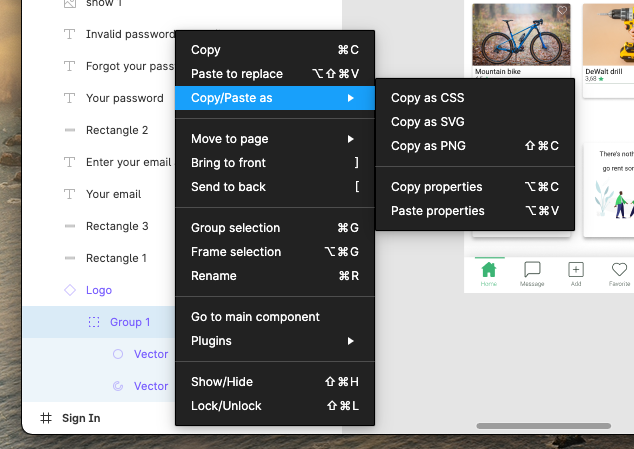

# How to correctly import SVG

This document is a guide-line to correctly use SVG icon and image

1. Go in Figma and export as SVG the icon/image you want to use
   - Right on the icon/image component in the left pane
   - Copy/Paste as
   - Copy as SVG



2. Create a new file named after your icon (ex. logo.svg)

3. Paste the svg in the newly created file

4. Remove the `width` and `height` attribute in the svg tag to be able to customize is size! But, you have to leave the viewBox attribute! You could also put `fill="inherit"` in the path tag if you want your svg to herit the color from his parent!

```svg
<svg width="89" height="87" viewBox="0 0 89 87" fill="none" xmlns="http://www.w3.org/2000/svg">
<path xxx fill="#3CB474"/>
</svg>
```

Should look like :

```svg
<svg viewBox="0 0 89 87" fill="none" xmlns="http://www.w3.org/2000/svg">
<path xxx fill="inherit"/>
</svg>
```

5. Import your svg just like a component (changes were required in [Next config file](../../frontend//next.config.js) in order to work)
   - `import Logo from './logo.svg'`
   - Use it like : `<Logo />`
